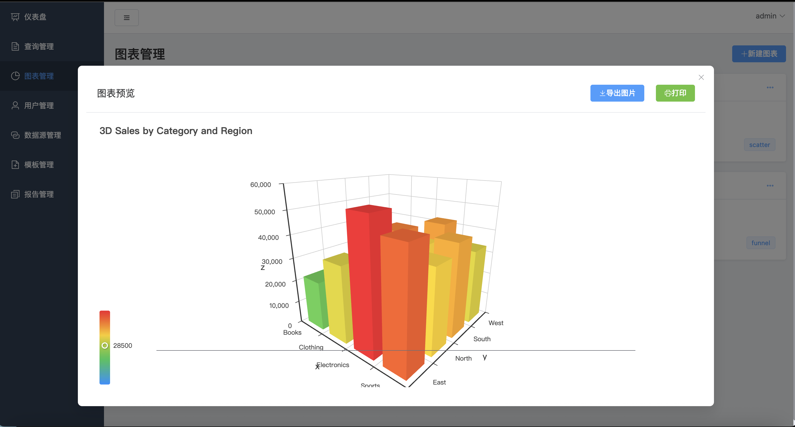

# Gobi BI 系统前端

Gobi BI 是一套现代化的商业智能（BI）解决方案，本项目是其前端实现，基于 Vue 3 和 Element Plus 构建，提供数据可视化、查询与报告等核心功能。

## 📸 功能预览

| 仪表盘 (Dashboard) | 图表管理 (Charts) |
| :---: | :---: |
|  |  |

| 图表预览 (Chart Preview) |
| :---: |
|  |

## ✨ 核心功能

- **仪表盘**: 系统核心指标、查询趋势与热门查询一览。
- **查询管理**: 支持 SQL 查询的创建、执行与结果预览。
- **图表管理**: 支持多种图表类型，可灵活配置并导出为图片。
- **报告管理**: 支持自动化生成日报、周报、月报，并可下载。
- **模板管理**: 支持上传 Excel 模板，用于生成定制化报告。
- **数据源与用户管理**: 提供基础的系统管理功能。

## 🛠️ 技术栈

- **前端框架**: Vue 3 (组合式 API)
- **UI 组件库**: Element Plus
- **构建工具**: Vite
- **图表库**: ECharts
- **HTTP**: Axios (已封装请求/响应拦截器)
- **路由**: Vue Router (包含路由守卫)
- **样式**: SCSS

## 🚀 快速开始

1.  **克隆项目**
```bash
    git clone <your-repo-url>
cd GobiWeb
```

2.  **安装依赖**
```bash
npm install
```

3.  **启动开发服务器**
```bash
npm run dev
```
    服务将运行在 `http://localhost:5173`。

4.  **构建生产版本**
```bash
npm run build
```

## 📂 项目结构

```
/src
├── layouts/       # 主体布局
├── views/         # 页面视图
├── components/    # 可复用组件
├── router/        # 路由配置
├── utils/         # 工具函数 (如 axios 封装)
├── styles/        # 全局样式
├── assets/        # 静态资源
├── main.js        # 入口文件
└── App.vue        # 根组件
```

## ⚙️ 后端配置

开发模式下，Vite 已配置好代理，所有 `/api` 开头的请求都会被转发到 `http://localhost:8080`。请确保后端服务在该地址运行。

## 🤝 开发规范

- **代码风格**: 遵循 ESLint 和 Prettier 规范。
- **提交信息**: 建议遵循 `type(scope): subject` 的格式 (例如: `feat(reports): add export button`)。
  - `feat`: 新功能
  - `fix`: 修复 Bug
  - `docs`: 文档变更
  - `style`: 代码格式
  - `refactor`: 代码重构
  - `chore`: 构建或工具变动

## 主要功能模块

### 1. 仪表盘 (Dashboard)
- 系统概览和关键指标展示
- 数据统计和趋势分析
- 查询执行统计
- 热门查询排行

### 2. 查询管理 (Queries)
- 创建和编辑 SQL 查询
- 查询执行和结果预览
- 数据源关联管理
- 查询历史记录

### 3. 图表管理 (Charts)
- 创建和编辑多种类型图表
- 智能数据字段映射
- 图表样式和配置定制
- **图表预览和导出功能**
  - 实时图表预览
  - 一键导出为 PNG 图片
  - 支持图表打印
  - 高质量图片输出（2倍像素比率）

#### 支持的图表类型
- **柱状图**: 适合分类数据对比
- **折线图**: 适合趋势数据展示
- **饼图**: 适合占比数据展示
- **散点图**: 适合相关性分析
- **雷达图**: 适合多维度数据对比
- **热力图**: 适合矩阵数据展示
- **仪表盘**: 适合关键指标展示
- **漏斗图**: 适合流程转化分析

### 4. 数据源管理 (DataSources)
- 支持多种数据库类型
  - MySQL
  - PostgreSQL
  - SQLite
- 数据源连接配置
- 连接测试功能
- 权限控制（公开/私有）

### 5. 模板管理 (Templates)
- Excel 模板上传
- 模板分类管理
- 模板描述和版本控制

### 6. 用户管理 (Users)
- 用户账户管理
- 角色权限控制
- 密码重置功能

## 图表导出/打印功能详解

### 导出图片功能
- **使用方式**: 在图表预览弹窗中点击"导出图片"按钮
- **输出格式**: PNG 格式，支持透明背景
- **图片质量**: 2倍像素比率，确保高清晰度
- **文件命名**: 自动生成 `图表名称_时间戳.png` 格式
- **兼容性**: 支持所有图表类型

### 打印功能
- **使用方式**: 在图表预览弹窗中点击"打印"按钮
- **打印内容**: 图表图片 + 标题 + 打印时间
- **打印样式**: 优化的打印布局，自动居中显示
- **浏览器兼容**: 支持主流浏览器的打印功能

## 开发指南

### 代码规范
- 使用 ESLint 进行代码检查
- 遵循 Vue 3 组合式 API 风格
- 使用 TypeScript 进行类型检查
- 组件命名采用 PascalCase
- 文件命名采用 kebab-case

### 提交规范
提交信息格式：
```
<type>(<scope>): <subject>

<body>

<footer>
```

type 类型：
- `feat`: 新功能
- `fix`: 修复
- `docs`: 文档
- `style`: 格式
- `refactor`: 重构
- `test`: 测试
- `chore`: 构建过程或辅助工具的变动

### 分支管理
- `main`: 主分支，用于生产环境
- `develop`: 开发分支，用于开发环境
- `feature/*`: 功能分支，用于开发新功能
- `hotfix/*`: 修复分支，用于修复生产环境的问题

## API 接口

### 图表相关接口
- `GET /api/charts` - 获取图表列表
- `POST /api/charts` - 创建图表
- `PUT /api/charts/:id` - 更新图表
- `DELETE /api/charts/:id` - 删除图表

### 查询相关接口
- `GET /api/queries` - 获取查询列表
- `POST /api/queries` - 创建查询
- `POST /api/queries/:id/execute` - 执行查询

### 数据源相关接口
- `GET /api/datasources` - 获取数据源列表
- `POST /api/datasources` - 创建数据源
- `PUT /api/datasources/:id` - 更新数据源

## 部署

1. 构建项目
```bash
npm run build
```

2. 部署 dist 目录到 Web 服务器

### 环境变量配置
```bash
# 开发环境
VITE_API_BASE_URL=http://localhost:8080/api

# 生产环境
VITE_API_BASE_URL=https://your-api-domain.com/api
```

## 浏览器兼容性

- Chrome >= 88
- Firefox >= 85
- Safari >= 14
- Edge >= 88

## 性能优化

- 使用 Vite 进行快速构建
- 图表按需加载
- 图片懒加载
- 组件懒加载
- 代码分割

## 贡献指南

1. Fork 本仓库
2. 创建你的特性分支 (git checkout -b feature/AmazingFeature)
3. 提交你的改动 (git commit -m 'Add some AmazingFeature')
4. 推送到分支 (git push origin feature/AmazingFeature)
5. 开启一个 Pull Request

## 更新日志

### v1.1.0 (最新)
- ✨ 新增图表导出/打印功能
- 🎨 优化图表预览界面
- 🔧 改进数据字段自动适配
- 🐛 修复多种图表类型的渲染问题

### v1.0.0
- 🎉 初始版本发布
- 📊 基础图表功能
- 🔍 查询管理功能
- 👥 用户管理功能

## 联系方式

- 项目维护者：[sy-vendor]
- 邮箱：[sytourist@gmail.com]
- 项目地址：[GitHub Repository]